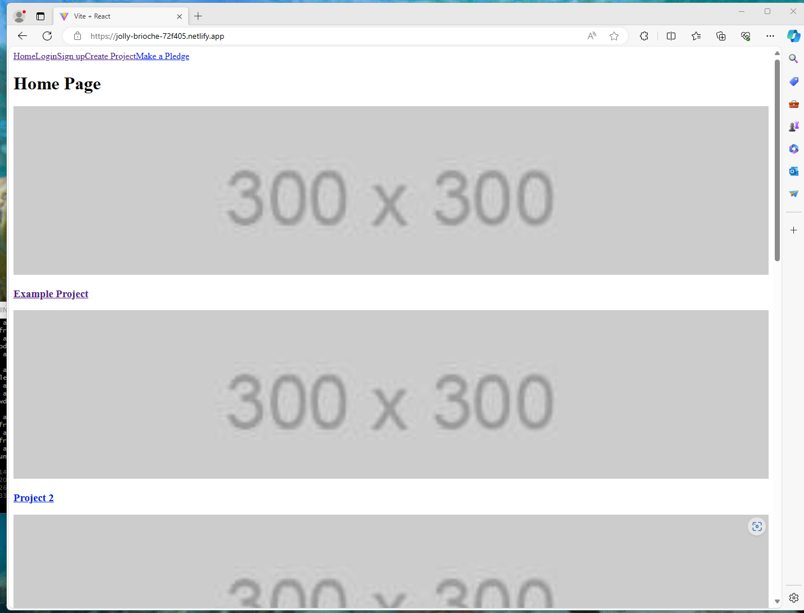
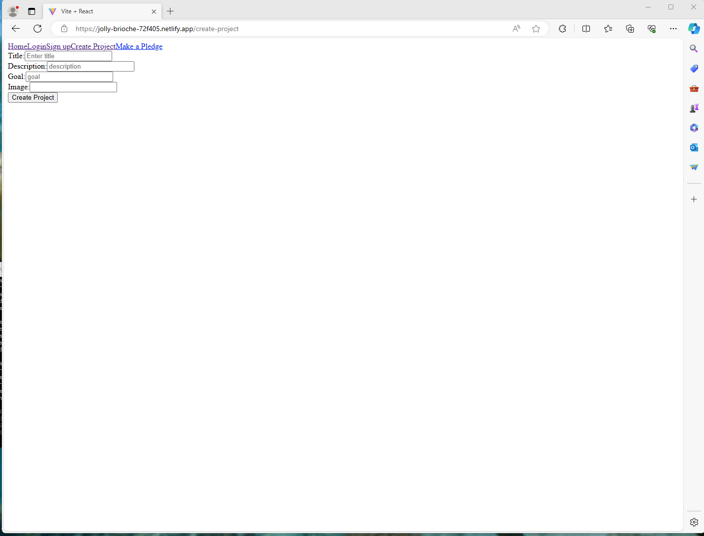
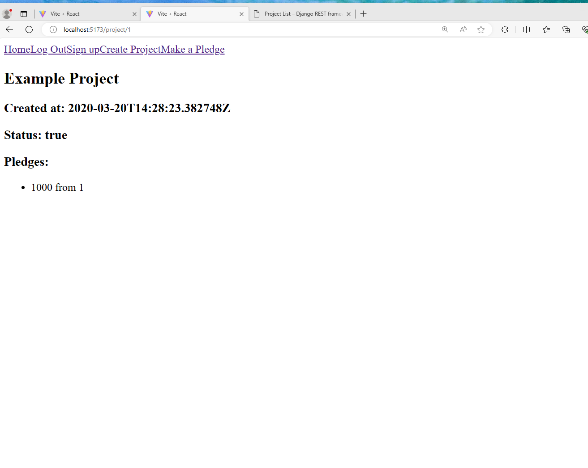
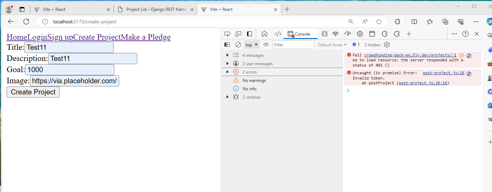
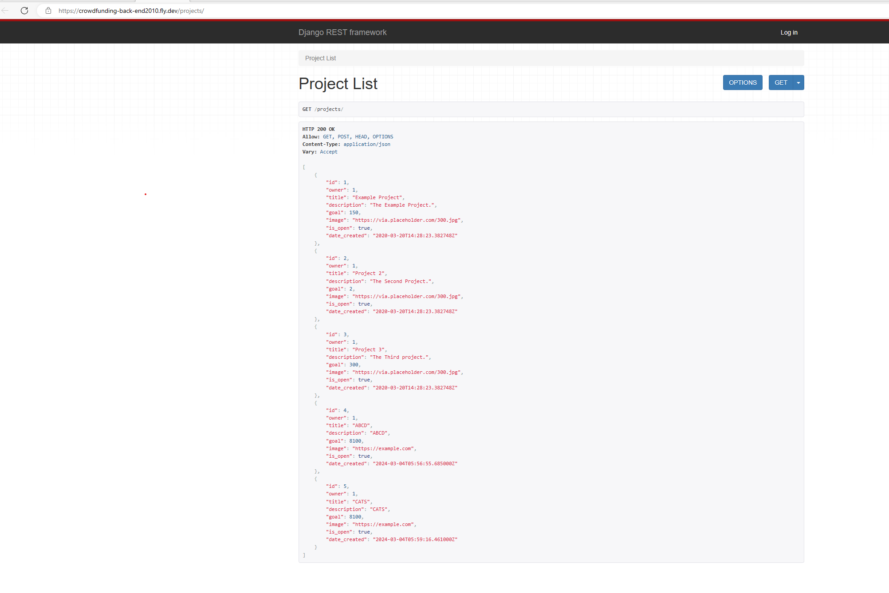
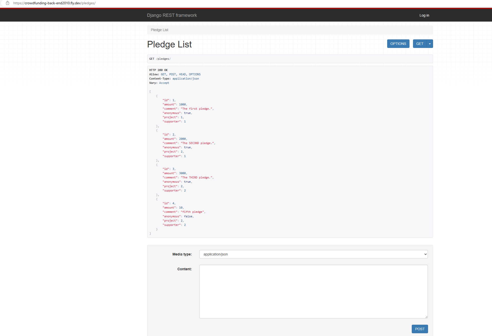

# React + Vite

This template provides a minimal setup to get React working in Vite with HMR and some ESLint rules.

Currently, two official plugins are available:

- [@vitejs/plugin-react](https://github.com/vitejs/vite-plugin-react/blob/main/packages/plugin-react/README.md) uses [Babel](https://babeljs.io/) for Fast Refresh
- [@vitejs/plugin-react-swc](https://github.com/vitejs/vite-plugin-react-swc) uses [SWC](https://swc.rs/) for Fast Refresh
# crowdfunding-frontend

[ ] A link to the deployed project.
https://jolly-brioche-72f405.netlify.app/

https://github.com/boneycd/crowdfunding-frontend

[ ] A screenshot of the homepage

[ ] A screenshot of the project creation page/project creation form

[ ] A screenshot of a project with pledges

[ ] A screenshot of the resulting page when an unauthorized user attempts to create a  project 

Future implementation plans:
Work on the frontend css and make the website moree presentable  
Update meaningfull project( and remove the test ones)

